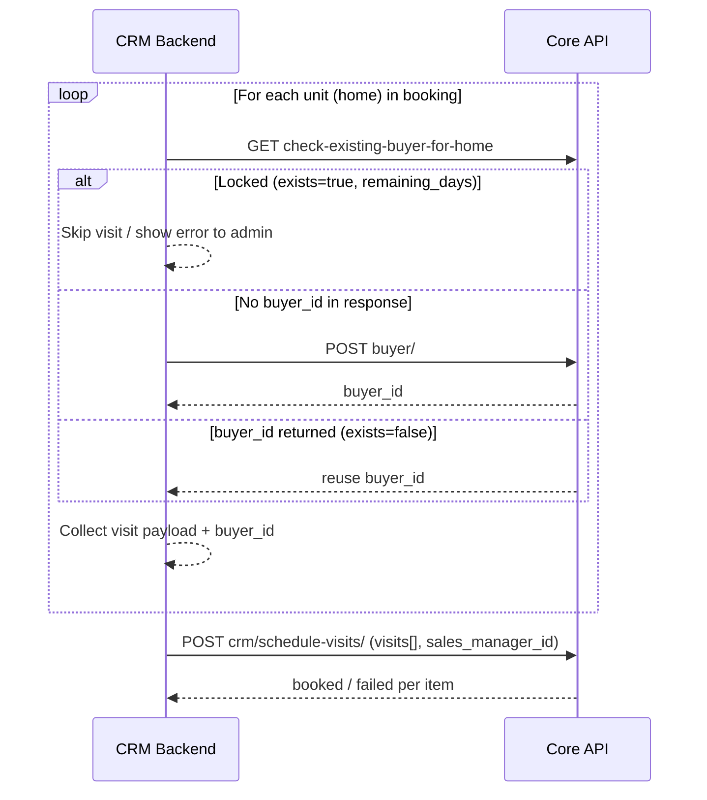

# CRM → Core: Visit booking integration guide

**Audience:** Demand CRM backend team  
**Goal:** Book one or more home visits from the CRM using existing Core APIs + the CRM bulk endpoint.

---

## TL;DR flow (per visit)

```
For each home in the CRM booking action:

  1. GET  check-existing-buyer-for-home   → 45-day lock check + reuse buyer_id if possible
  2. POST buyer/                          → only if step 1 did not return a buyer_id
  3. POST crm/schedule-visits/            → book visit(s) with buyer_id (bulk up to 10)
```

Steps 1–2 can run **per visit** on the CRM side. Step 3 sends **all ready visits in one request** (max 10).

---

## Base URL

| Environment | Base |
|-------------|------|
| Staging | `https://staging-561394753846.asia-south2.run.app/api/v1/oh/` |

All paths below are relative to this base.

---

## Authentication

All three CRM booking APIs use the **same** server-to-server header:

```
X-CRM-Key: <CRM_API_KEY>
```

No app session token is required for the full CRM flow (steps 1–3).

| Endpoint | Auth |
|----------|------|
| `check-existing-buyer-for-home/` | `X-CRM-Key` **or** `Authorization: Bearer <session_token>` (app only) |
| `buyer/` | `X-CRM-Key` + `sales_manager_id` in body **or** sales/broker session token |
| `crm/schedule-visits/` | `X-CRM-Key` only |

> When using `X-CRM-Key` on `buyer/`, `sales_manager_id` is **required** in the JSON body (sets `added_by` to `sales:<id>`).  
> `check-existing-buyer-for-home/` does **not** need `sales_manager_id` — only the API key.

Set `CRM_API_KEY` on Core (env / Secret Manager). Share the same value with the CRM backend.

---

## End-to-end sequence



---

## Step 1 — Check existing buyer for home (45-day lock)

**Purpose:** Same privacy model as the CP app — match buyer by **last 5 digits** (+ optional **name**). Block booking if buyer recently completed a visit on this home with another CP.

```
GET /api/v1/oh/check-existing-buyer-for-home/?home_id={homeId}&last_five_digits={digits}&name={buyerName}
X-CRM-Key: <CRM_API_KEY>
```

Or with app session:

```
GET /api/v1/oh/check-existing-buyer-for-home/?home_id={homeId}&last_five_digits={digits}&name={buyerName}
Authorization: Bearer <session_token>
```

### Query parameters

| Param | Required | Notes |
|-------|----------|-------|
| `home_id` | Yes | Core `Home.id` |
| `last_five_digits` | Yes | Last 5 digits of buyer mobile (string) |
| `name` | Recommended | Case-insensitive match; use when available |

### Responses

**A) Locked — do not book**

```json
{
  "exists": true,
  "buyerId": 42,
  "name": "Rahul Sharma",
  "remainingDays": 30,
  "message": "The Buyer is registered already with another CP for 30 more days"
}
```

→ Stop this visit. Show `remainingDays` in the CRM UI.

**B) Buyer found, no recent visit — reuse `buyer_id`**

```json
{
  "exists": false,
  "buyerId": 42,
  "name": "Rahul Sharma",
  "message": "No recent visits found for buyer Rahul Sharma with these last 5 digits."
}
```

→ Use `buyerId` in step 3. **Skip step 2.**

**C) No matching buyer**

```json
{
  "exists": false,
  "message": "No buyer found with this name and these last 5 digits."
}
```

→ Go to **step 2** to create a buyer.

---

## Step 2 — Create buyer

Only when step 1 did **not** return a `buyer_id`.

```
POST /api/v1/oh/buyer/
X-CRM-Key: <CRM_API_KEY>
Content-Type: application/json
```

### Body

```json
{
  "sales_manager_id": 1,
  "name": "Rahul Sharma",
  "mobile_number": "98765",
  "broker_id": 28,
  "profession": ""
}
```

| Field | Required | Notes |
|-------|----------|-------|
| `sales_manager_id` | Yes (CRM) | Core `SalesManager.id` — used for `added_by` (`sales:<id>`) |
| `name` | Yes | Buyer name |
| `mobile_number` | Yes | Partial mobile OK (max 10 chars in DB); often last 5–10 digits |
| `broker_id` | Yes | Core `Broker.id` for the CP on this visit |
| `profession` | No | Defaults to empty |

### Success `201`

```json
{
  "id": 99,
  "name": "Rahul Sharma",
  "mobileNumber": "98765",
  "brokerId": 28,
  "addedBy": "sales:1"
}
```

Use `id` as `buyer_id` in step 3.

> CRM: send `X-CRM-Key` + `sales_manager_id` — no session login needed. `added_by` is set to `sales:<sales_manager_id>`.

---

## Step 3 — CRM schedule visit(s)

**Purpose:** Create 1–10 visits in one call. Reuses the same visit logic as the app (`create_schedule_visit`), sets `platform: "crm"`, and runs broker notifications.

```
POST /api/v1/oh/crm/schedule-visits/
X-CRM-Key: <CRM_API_KEY>
Content-Type: application/json
```

### Bulk body (recommended)

```json
{
  "sales_manager_id": 1,
  "visits": [
    {
      "buyer_id": 99,
      "broker_id": 28,
      "home_id": 8,
      "selected_date": "2026-06-20",
      "selected_time": "5-7 PM",
      "source": "channel_partner",
      "lead_status": "select_status",
      "cp_code": "CP00028"
    },
    {
      "buyer_id": 99,
      "broker_id": 28,
      "home_id": 7,
      "selected_date": "2026-06-21",
      "selected_time": "3-5 PM",
      "source": "channel_partner"
    }
  ]
}
```

### Top-level fields

| Field | Required | Notes |
|-------|----------|-------|
| `sales_manager_id` | Yes | Core `SalesManager.id` (who booked in CRM) |
| `visits` | Yes (bulk) | Array length **1–10** |

### Per-visit fields

| Field | Required | Notes |
|-------|----------|-------|
| `buyer_id` | Yes | From step 1 or 2 |
| `broker_id` | Yes | Core `Broker.id` |
| `home_id` | Yes | Core `Home.id` |
| `selected_date` | Yes | `YYYY-MM-DD` |
| `selected_time` | Yes | One of: `9-11 AM`, `11-1 PM`, `1-3 PM`, `3-5 PM`, `5-7 PM`, `7-9 PM` |
| `source` | No | `channel_partner` (default) or `direct` |
| `lead_status` | No | Default `select_status` |
| `cp_code` | No | Fallback if `broker_id` is stale |

### Bulk success `200`

```json
{
  "createdBySalesManager": {
    "name": "Akshit Chaudhary",
    "mobile": "9810012345"
  },
  "booked": 2,
  "failed": 0,
  "results": [
    {
      "homeId": 8,
      "ok": true,
      "visit": {
        "id": 336,
        "buyerId": 99,
        "brokerId": 28,
        "homeId": 8,
        "selectedDate": "2026-06-20",
        "selectedTime": "5-7 PM",
        "status": "upcoming",
        "source": "channel_partner",
        "platform": "crm",
        "leadStatus": "select_status",
        "visitUuid": "29745c9d-39fa-42c6-bd42-92a491aee27e",
        "salesManagerId": 1
      }
    }
  ]
}
```

Visits are created **sequentially**. If item 2 fails, item 1 remains created; check each `results[].ok`.

### Single visit (optional)

Omit the `visits` array and put visit fields at the root (still include `sales_manager_id`):

```json
{
  "sales_manager_id": 1,
  "buyer_id": 99,
  "broker_id": 28,
  "home_id": 8,
  "selected_date": "2026-06-20",
  "selected_time": "5-7 PM"
}
```

Success → `201` with the visit object directly (not wrapped in `results`).

---

## CRM implementation checklist

For each unit the admin selects in CRM:

1. [ ] `GET check-existing-buyer-for-home` with `home_id`, `last_five_digits`, `name`
2. [ ] If `exists === true` → show lock message; **do not** add to batch
3. [ ] If `exists === false` and no `buyer_id` → `POST buyer/`
4. [ ] Store `buyer_id`, `broker_id`, `home_id`, date, time, source
5. [ ] When batch ready (≤10) → `POST crm/schedule-visits/` with `X-CRM-Key`
6. [ ] If more than 10 units → split into multiple CRM schedule calls

---

## Error reference

### `crm/schedule-visits/`

| HTTP | Meaning |
|------|---------|
| `401` | Missing or wrong `X-CRM-Key` |
| `503` | `CRM_API_KEY` not configured on Core |
| `400` | Missing fields, empty `visits`, or >10 items |
| `422` | Invalid `sales_manager_id` |
| `200` + `failed > 0` | Partial bulk success — inspect `results[].error` |

Common per-item errors: `Buyer not found.`, `Home not found.`, `Broker not found.`, `All fields are required.`, `Invalid selected_date format. Use YYYY-MM-DD.`

### `check-existing-buyer-for-home/`

| HTTP | Meaning |
|------|---------|
| `401` | Wrong/missing `X-CRM-Key` (CRM path) or no session token (app path) |
| `503` | `X-CRM-Key` sent but `CRM_API_KEY` not configured on Core |
| `404` | `home_id` not found |
| `400` | Missing `home_id` or `last_five_digits` |

### `buyer/`

| HTTP | Meaning |
|------|---------|
| `401` | Wrong/missing `X-CRM-Key` (CRM path) or no session token (app path) |
| `503` | `X-CRM-Key` sent but `CRM_API_KEY` not configured on Core |
| `400` | Missing `sales_manager_id` (CRM path), or missing name / mobile / broker_id, or invalid broker |
| `422` | CRM key OK but `sales_manager_id` not found in DB |

---

## Optional — check buyer by full mobile

If you already have the **full** mobile number and only need to know if a buyer exists (not the 45-day home lock):

```
GET /api/v1/oh/check-existing-buyer/?mobile_number=9876543210
Authorization: Bearer <session_token>
```

This is **not** a substitute for `check-existing-buyer-for-home` when booking a visit on a specific home.

---

## Related code

| Piece | Location |
|-------|----------|
| CRM API key auth | `oh/crm_auth.py` → `crm_authenticated()`, `resolve_crm_sales_manager()` |
| CRM schedule endpoint | `oh/crm_views.py` → `CRMScheduleVisitsAPIView` |
| Shared visit creation | `oh/views.py` → `create_schedule_visit()` |
| Buyer create | `oh/views.py` → `BuyerAPIView` |
| 45-day lock check | `oh/views.py` → `CheckExistingBuyerForHomeAPIView` |
| URL routes | `oh/urls.py` |
| CRM API key env | `CRM_API_KEY` in Core `.env` / Secret Manager / `core/settings.py` |
